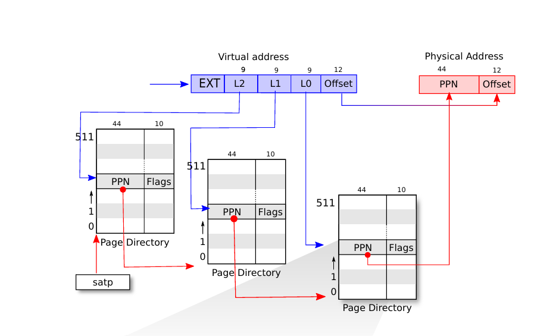
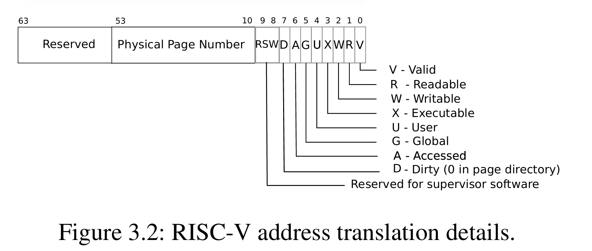
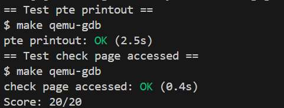

# Đồ án hệ điều hành
## Lab 02: Page Table
### A. Làm việc nhóm
#### 1. Thông tin nhóm
|MSSV|Họ và tên|
|---|---|
|23120097|Võ Tất Toàn|
|23120146|Hoàng Ngọc|
|23122012|Lê Thái Ngọc|

#### 2. Đánh giá công việc

|Công việc| Phân công| Độ hoàn thiện|
|---|---|---|
|Mã nguồn Print Page Table|Lê Thái Ngọc|100%|
|Mã nguồn Detect Page Accessed|Hoàng Ngọc, Võ Tất Toàn|100%|
|Viết báo cáo|Hoàng Ngọc, Tất Toàn, Thái Ngọc|100%|

### B.Chi tiết đồ án
### 1. Print Page Table

#### 1.1 Mô tả chức năng

- Xây dựng một hàm `vmprint()` để in ra cấu trúc page table của một tiến trình.
- Hàm này sẽ duyệt qua toàn bộ 3 level của page table và in ra thông tin của từng PTE có hiệu lực (valid).
- Thông tin bao gồm: index của PTE, giá trị PTE và physical address được trích xuất từ PTE.
- Kết quả được in ra với lùi từng dòng ".." để chỉ ra độ sâu trong cây page table.

#### 1.2 Các bước cài đặt

- Hàm được định nghĩa trong `kernel/vm.c` tại dòng 453.

```c
void
vmprint(pagetable_t pagetable)
{
  printf("page table %p\n", pagetable);
  for(int i = 0; i < 512; i++){
    pte_t pte_l2 = pagetable[i];
    if(pte_l2 & PTE_V){
      // Level 2
      // Here is code  that print L2 entry
      // Check entry whether it is leaf ?
      if((pte_l2 & (PTE_R|PTE_W|PTE_X)) == 0){
        // Level 1 page table address
        pagetable_t pt_l1 = (pagetable_t)PTE2PA(pte_l2);
        
        // Level 1
        for(int j = 0; j < 512; j++){
          pte_t pte_l1 = pt_l1[j];
          if(pte_l1 & PTE_V){
            // Here is code that print L1 entry
            // Check entry whether it is leaf ?
            if((pte_l1 & (PTE_R|PTE_W|PTE_X)) == 0){
              // Level 0 page table address
              pagetable_t pt_l0 = (pagetable_t)PTE2PA(pte_l1);
              
              // Level 0 (leaf)
              for(int k = 0; k < 512; k++){
                pte_t pte_l0 = pt_l0[k];
                if(pte_l0 & PTE_V){
                  // Here is code that print L1 entry
                }
              }
            }
          }
        }
      }
    }
  }
}
```


- Bước 1: Thêm khai báo: `void vmprint(pagetable_t);` vào `kernel/defs.h`để có thể gọi từ `kernel/exec.c`

- Bước 2: Hàm được gọi trong `kernel/exec.c` tại dòng 131, ngay trước khi return argc. Điều này đảm bảo rằng page table được in ra không ảnh hưởng tới flow của exec system call.

```c
...
  proc_freepagetable(oldpagetable, oldsz);
  if(p->pid == 1) { // Only print vm for init process
    vmprint(p->pagetable);
  }

  return argc; // this ends up in a0, the first argument to main(argc, argv)
```

- Bước 3: Thuật toán duyệt qua Page Table

  **Cấu trúc RISC-V 3-level page table:**
  - Level 2 (root): Duyệt tất cả 512 entries
  - Level 1: Nếu PTE level 2 không phải leaf (không có R/W/X flags), duyệt tiếp level 1
  - Level 0 (leaf): Nếu PTE level 1 không phải leaf, duyệt level 0
  - Chỉ in những PTE có flag PTE_V (valid) được bật

  **Tính toán Physical Address:**
  - Sử dụng macro `PTE2PA()`: `(((pte) >> 10) << 12)` (định nghĩa trong `riscv.c`)
  - Công thức này trích xuất physical address từ PTE (shift phải 10 bit để bỏ flags, rồi shift trái 12 bit để nhân với PGSIZE)

  **Đặc điểm Leaf pages:**
  - Leaf PTE là những PTE có R/W/X flags được bật (có quyền đọc, ghi, hoặc thực thi)
  - Những PTE không phải leaf (chỉ có V flag) là page table pages, trỏ tới level tiếp theo

 

### 2. Detect Accessed Page
#### 2.1 Mô tả chức năng

- Xây dựng một syscall `pgaccess()` để kiểm tra xem trang nào đã được truy cập.
- Để biết được trang nào được truy cập thì ta sẽ kiểm tra cờ A trong một PTE. Khi cờ PTE_A được bật thì trang này đã được truy cập và ngược lại.

#### 2.2 Các bước cài đặt

##### Trong không gian User
- Để có thể test được xem hàm chạy có đúng không thì ta có thể check bằng cách thêm file `pgtbltest.c` ở bên nhánh pgtbl trên repo Github.
- Thực hiện khai báo một hàm `pgaccess()` nhận vào 3 đối số bao gồm
  - Địa chỉ Virtual Address bắt đầu
  - Số trang kiểm tra
  - Bitmask để trả kết quả về cho người dùng.

- Khai báo hàm trong `usys.pl` để có thể gọi hàm trong Kernel.

##### Trong không gian Kernel

- Bước 1: Thực hiện khai báo hàm để Kernel có thể gọi và ánh xạ từ User. Khai báo trong `syscall.h` và `syscall.c`

```c
// syscall.h
#define SYS_pgaccess 24
```

```c
// syscall.h
extern uint64 sys_pgaccess(void);
...
static uint64 (*syscalls[])(void) = {
    [SYS_pgaccess] sys_pgaccess,
}
```
- Bước 2: Định nghĩa cờ PTE_A để kiểm tra các page có được truy cập hay không.
```c
// riscv.h
#define PTE_V (1L << 0) // valid
#define PTE_R (1L << 1)
#define PTE_W (1L << 2)
#define PTE_X (1L << 3)
#define PTE_U (1L << 4) // user can access
#define PTE_A (1L << 7) // Bit to see whether page is accessed
```

- Bước 3: Thực hiện định nghĩa `sys_pgaccess()` trong `sysproc.c`

  - Bước 3.1: Thực hiện nhận 3 tham số bao gồm địa chỉ bắt đầu, số trang kiểm tra và bitmask để trả kết quả về. Sử dụng 2 hàm `argaddr()` và `argint()`.

    ```c
    argaddr(0, &va); // va = virtual addr start
    argint(1, &n); // number of page check
    argaddr(2, &mask); // buffer for result
    ```

  - Bước 3.2: Kiểm tra xem các tham số truyền vào đã đủ chưa và số trang kiểm tra sẽ bị giới hạn (limit là 64)
  - Bước 3.3: Thực hiện vòng lặp để bắt đầu di chuyển tới những page cần check, tại mỗi lần lặp, bước nhảy vừa bằng một PGSIZE.
  ```c
    for(int i = 0; i < n; i++)
    {
        uint64 va_current = va + i * PGSIZE; // Next address
        if(va_current >= p->sz) break; // Break if address out of range
    }
  ```
  - Bước 3.4: Để lấy được Page Table Entry trong bảng thì ta có thể sử dụng hàm `Walk()` được cung cấp trong `kernel/vm.c`. Hàm này trả về entry có địa chỉ logic truyền vào.
  ```c
    pte_t* pte = walk(p->pagetable, va_current, 0);
  ```

  - Bước 3.5: Sau khi có được entry đó rồi, entry này bản chất là dãy bit tiêu chuẩn của một entry, trong đó cờ A (Access) là cờ nằm ở bit thứ 6
 
  - Khi đó ta chỉ cần kiểm tra xem entry có tồn tại và cờ A có được bật hay không, sau đó lưu vào biến kết quả.

  ```c
    if(pte != 0){
      if(*pte & PTE_A){
        result |= (1L << i);
        *pte &= ~PTE_A;
      }
    }
  ```
  - Bước 3.6: Sau khi lấy được và lưu vào biến `result`, ta thực hiện clear cờ A để sau này `pgaccess()` có được gọi thì trạng thái của page đã được reset.

- Bước 4: Thực hiện đưa kết quả qua không gian User bằng hàm `Copyout()`.

```c
  if(copyout(p->pagetable, mask,(char *)&result, sizeof(result)) < 0)    
      return -1;
```

### 3. Thử nghiệm và kết quả
- Đại học MIT có cung cấp 2 test để kiểm tra xem liệu code có đạt yêu cầu hay không, 
- Để kiểm tra xem bảng in có chuẩn không trong bài Print Page Table thì người ta kiểm tra pattern in ra có đúng theo mẫu. Test này nằm trong file grade-lab-util.
- Để kiểm tra xem các bit có được bật đúng hay không thì trong `user/pgtbltest.c` có hàm `pgaccess()` để kiểm tra xem các bit trả về có đúng như mong đợi hay không.
- Để chạy test, ta chỉ cần chạy câu lệnh MakeFile
```bash
    make grade
```
- Kết quả thu được:

 


 